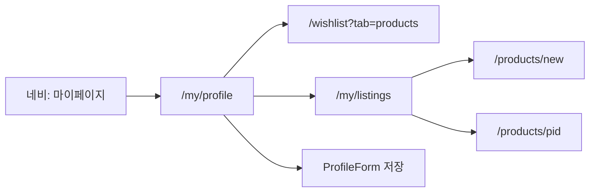
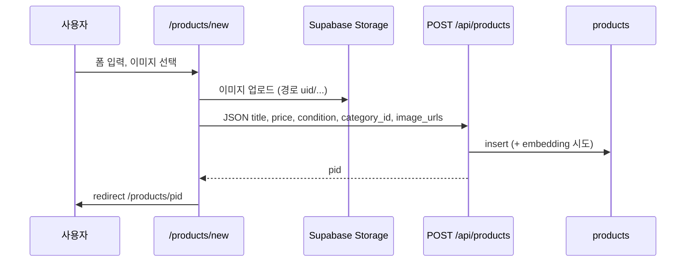

# PLAN — 마이페이지 · 판매 흐름 정리

**작성일:** 2026-05-14  
**목적:** 상단 네비의 **「마이페이지」**·**「판매」** 진입점 기준으로 화면 구성과 사용자·데이터 흐름을 한곳에 정리한다.  
**관련:** `docs/flow-design.md` §4(네비)·§5(Route), `src/components/layout/NavBar.tsx`

---

## 1. 네비게이션에서의 위치

| 라벨 | `href` | 비고 |
|------|--------|------|
| 판매 | `/products/new` | 별칭 경로 `/sell` 은 동일 화면으로 **리다이렉트** |
| 마이페이지 | `/my/profile` | 허브 페이지; 하위에 판매 목록·찜 연결 |

---

## 2. 마이페이지 — 구성

### 2.1 라우트 맵

```
/my/profile     … 마이 허브 (CTA + 프로필 폼)
/my/listings     … 내가 등록한 상품 그리드
/my/account      … 계정(별도 화면, 프로필 허브와 분리)
```

### 2.2 `/my/profile` 화면 블록 (위 → 아래)

1. **제목:** 「마이페이지」
2. **행동 버튼 (가로 배치, 반응형 줄바꿈)**  
   - **찜 목록 보기** → `/wishlist?tab=products` (위시리스트의 상품 탭으로 진입)  
   - **판매 상품 목록 보기** → `/my/listings`
3. **`ProfileForm`** — 닉네임·프로필 이미지 등 편집 (컴포넌트 내부 API 연동)

### 2.3 `/my/listings` 화면 블록

- **제목:** 「판매 상품」 / 부제: 내가 등록한 상품 목록
- **데이터:** 클라이언트 `GET /api/my/products` (쿠키 포함)
  - 선택 필드: `pid`, `title`, `price`, `status`, `condition`, `created_at`, `product_images`
  - 필터: `seller_uid = 본인`, `deleted_at IS NULL`
- **카드 그리드:** 썸네일(없으면 플레이스홀더) + **거래 상태 뱃지** (`selling`→판매중, `reserved`→예약, `sold`→판매완료) + 제목 + 가격 → 클릭 시 `/products/[pid]`
- **빈 상태:** 「등록한 상품이 없어요」+ **판매하기** → `/products/new`
- **에러:** 401 시 로그인 유도, 기타 메시지 표시

> 물품 상태(상·중·하)는 API에서 내려오지만 **현재 카드 UI에는 표시하지 않음** — 거래 상태 중심으로 목록을 단순화.

### 2.4 마이페이지 사용자 흐름 (요약)



---

## 3. 판매 — 구성

### 3.1 진입

- 네비 **「판매」** → `/products/new`
- (레거시·북마크) **`/sell`** → `redirect('/products/new')`

### 3.2 `/products/new` 화면 블록 (폼 순서)

| 순서 | 블록 | 필수 | 비고 |
|:----:|------|:----:|------|
| 1 | 이미지 | 선택 | 최대 5장, 이미지 타입·10MB 이하, Storage `products` 업로드 |
| 2 | 제목 | ✅ | 최대 200자, 카운터 표시 |
| 3 | 상태(물품) | ✅ | **상 / 중 / 하** — DB `high` / `medium` / `low` 칩 선택 |
| 4 | 카테고리 | ✅ | 대분류 `select` → 소분류 있으면 추가 `select`; 소분류 없는 대분류는 자동으로 `categoryId` 설정 |
| 5 | 설명 | 선택 | 자유 서술 |
| 6 | 가격 | ✅ | 숫자 ≥ 0, 원 단위 표시 |
| — | 제출 | — | `POST /api/products` — 성공 시 `/products/{pid}` 로 이동 |

**부가:** URL 쿼리 `?price=` 로 초기 가격 프리필 가능 (`useSearchParams`).

### 3.3 판매 데이터 흐름



- **인증:** Storage 업로드·등록 모두 로그인 세션 필요.
- **`condition`:** 서버에서 `high` | `medium` | `low` 화이트리스트 검증 (`product_condition_t` 와 일치).

---

## 4. 마이 ↔ 판매 교차 흐름

| 출발 | 행동 | 도착 |
|------|------|------|
| 마이 `/my/listings` | 빈 목록에서 판매하기 | `/products/new` |
| 마이 `/my/listings` | 카드 클릭 | `/products/[pid]` (수정은 별도 `/products/[pid]/edit` 존재 시 해당 문서 갱신) |
| 판매 완료 후 | 자동 이동 | `/products/[pid]` (등록 직후 상세 확인) |

---

## 5. 구현 체크리스트 (유지보수용)

- [ ] `NavBar` 의 「판매」·「마이페이지」 `href` 와 본 문서 일치
- [ ] `/sell` → `/products/new` 리다이렉트 유지
- [ ] `ProfileForm` API 실패 시 사용자 메시지 (필요 시 `flow-design` 보완)
- [ ] `GET /api/my/products` 스키마 변경 시 listings 카드 필드 동기화

---

## 6. 변경 이력

| 날짜 | 내용 |
|------|------|
| 2026-05-14 | 초안 — 마이 허브·판매 목록·판매 폼·API 흐름 정리 |
